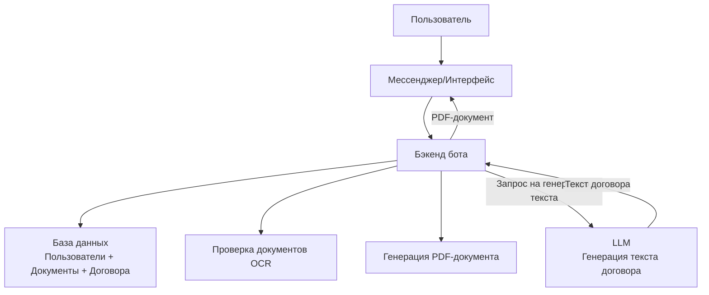

## Бот для генерации договора купли-продажи автомобиля (РФ)
Бот предназначен для автоматизации процесса подготовки договора купли-продажи автомобиля между физическими лицами в России. Бот собирает необходимые данные с помощью фотографий документов и ручного ввода, формирует договор и предоставляет его в формате PDF.

## Необходимые данные для каждого этапа
- Фото паспорта продавца (с возможностью ручного ввода ФИО, серия/номер, дата выдачи, кем выдан, адрес регистрации)
- Фото паспорта покупателя (с возможностью ручного ввода тех же данных)
- Фото СТС (с возможностью ручного ввода: номер, дата выдачи, VIN, марка/модель, год выпуска, цвет, госномер)
- Фото ПТС (с возможностью ручного ввода: серия/номер, данные о собственнике, VIN, марка/модель, год выпуска, цвет)
- Стоимость автомобиля (ручной ввод)
- Дата и место заключения договора (по умолчанию — текущая дата, город можно выбрать/ввести)

## Структура диалога с ботом
[Пример диалога](./dialog_exmple.md)

1. Приветствие и объяснение возможностей
2. Кнопка «Оформить документ»
3. Запрос фото паспорта продавца (или ручной ввод данных)
4. Запрос фото паспорта покупателя (или ручной ввод данных)
5. Запрос фото СТС (или ручной ввод данных)
6. Запрос фото ПТС (или ручной ввод данных)
7. Запрос стоимости автомобиля (ручной ввод)
8. Запрос даты и места сделки (по умолчанию — сегодня, город — по геолокации или ручной ввод)
9. Подтверждение всех данных пользователем
10. Генерация и отправка PDF-договора
11. Поддержка и ответы на вопросы

## Верхнеуровневая схема компонентов
