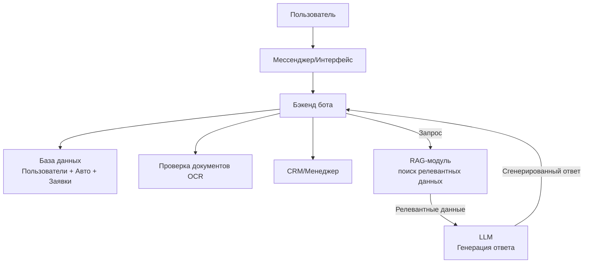

# ТЗ:
1. Расписать сценарии взаимодействия пользователей
2. Определить какие данные нужны для какого взаимодействия
3. Разработать структуру диалога с ботом
4. Сделать верхнеуровневую схему компонентов

## Бот для аренды автомобилей
Бот предназначен для автоматизации процесса аренды автомобилей для двух основных сценариев: работа в такси и личное использование. Бот должен собирать необходимые данные, показывать доступные авто, оформлять заявки и предоставлять поддержку.

## Необходимые данные для каждого этапа
- ФИО пользователя
- Возраст
- Фото водительского удостоверения
- Цель аренды (такси/личное)
- Срок аренды (дни/неделя/месяц)
- Номер телефона
- Параметры авто (класс, коробка)
- Выбранные дополнительные услуги
- Даты аренды
- Список доступных авто

## Структура диалога с ботом
[Пример диалога](./chat_example.md)
1. Приветствие и объяснение возможностей
2. Быстрые кнопки для выбора цели аренды
3. Запрос срока, города, телефона
4. Фильтры по параметрам авто
5. Показ доступных машин с фото и ценой
6. Запрос дополнительных услуг
7. Запрос фото прав и проверка
8. Информирование об условиях и требованиях
9. Оформление заявки/связь с менеджером/оплата
10. Поддержка и сбор отзывов

## Верхнеуровневая схема компонентов
